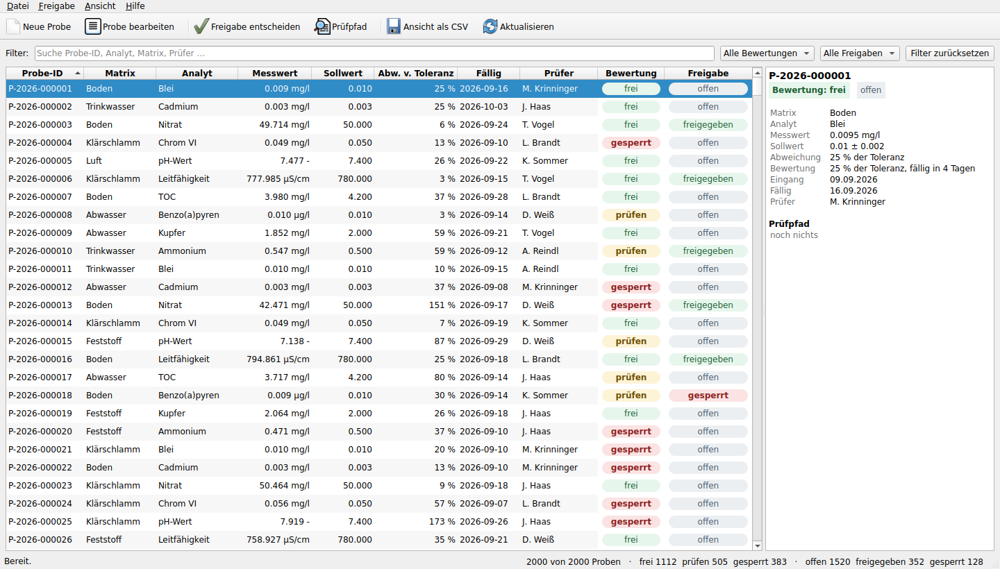
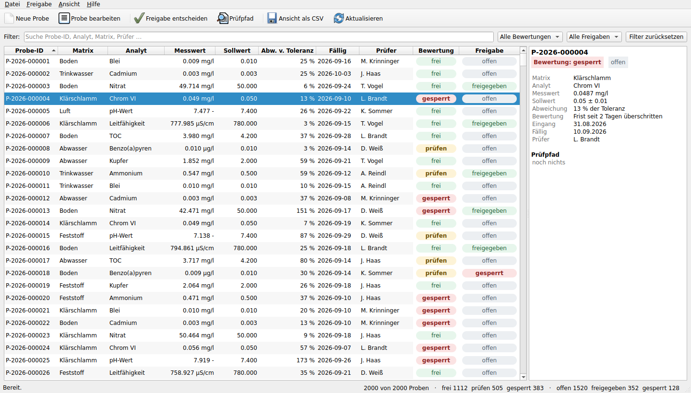
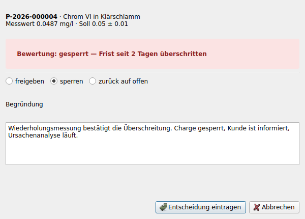
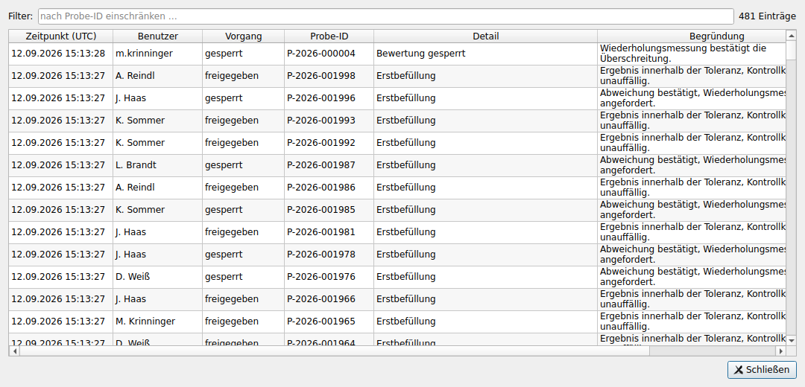

# LabControl

Freigabe von Laborproben mit Prüfpfad. Qt 6 über PySide6, SQLite als Ablage,
unter Windows eine einzelne Datei ohne Installation.



Die Ampel bewertet, ein Mensch entscheidet, der Prüfpfad hält beides fest —
in dieser Reihenfolge, weil eine 17025-Nachweisführung genau das verlangt.

## Was die Anwendung kann

* **Probenliste** mit Volltextsuche über Probe-ID, Analyt, Matrix und Prüfer,
  Filter nach Bewertung und Freigabestatus, Sortierung über jede Spalte.
* **Ampel** aus Messwert, Toleranz und Frist — und sie sagt, *warum* sie so
  steht: „Frist seit 3 Tagen überschritten" statt nur „gesperrt".
* **Freigeben und Sperren** durch eine Person, nie ohne Begründung. Wer eine
  Probe außerhalb der Toleranz freigeben will, wird ausdrücklich darauf
  hingewiesen.
* **Prüfpfad**, der nur wächst: Anlegen, jede Feldänderung mit Alt- und
  Neuwert, jede Entscheidung mit Benutzer, Zeitpunkt (UTC) und Begründung.
  Kein Ändern, kein Löschen — die Ablage bietet dafür keine Funktion an.
* **Anlegen und Bearbeiten** mit geprüften Eingaben; die Probe-ID bleibt beim
  Bearbeiten fest, sonst zerfiele der Prüfpfad.
* **CSV-Export** der gerade sichtbaren Liste, mit Semikolon und BOM, damit
  Excel sie ohne Rückfragen richtig öffnet.
* **Fensterzustand** — Größe, Aufteilung, Werkzeugleiste — bleibt erhalten.

| Auswahl mit Detailspalte | Entscheidung | Prüfpfad |
|---|---|---|
| [](docs/screenshots/app_auswahl.png) | [](docs/screenshots/app_entscheidung.png) | [](docs/screenshots/app_pruefpfad.png) |

## Die EXE aus GitHub Actions

Der Workflow [`.github/workflows/windows-exe.yml`](.github/workflows/windows-exe.yml)
baut bei jedem Push auf `labcontrol/`, `core/`, `packaging/` oder `tests/` eine
startbare Datei und hängt sie an den Lauf:

1. [Actions](../../actions/workflows/windows-exe.yml) öffnen, den obersten Lauf anklicken
2. unten unter **Artifacts** `LabControl-windows-x64` herunterladen
3. entpacken, `LabControl.exe` starten — keine Installation, kein Python nötig

Im Artefakt liegen die EXE, eine SHA256-Prüfsumme und das Protokoll des
Selbsttests. Der Workflow lässt sich unter *Run workflow* auch von Hand
auslösen; ein Tag `v1.0.0` legt zusätzlich ein Release an.

Der Lauf gibt die Datei nur heraus, wenn sie vorher gestartet ist: nach dem
Bauen ruft er `LabControl.exe --selftest` auf, was Datenbank, Filter,
Entscheidung, Prüfpfad, CSV-Export und alle Dialoge einmal durchspielt. Bricht
das ab, schlägt der Workflow fehl, statt eine kaputte Datei zu veröffentlichen.

### Warum 64 Bit und nicht x86-32

**Eine 32-Bit-Fassung ist nicht baubar.** Qt 6 wird für 32-Bit-Windows nicht
mehr ausgeliefert, und PySide6 hat entsprechend kein `win32`-Wheel — nur
`win_amd64`. Nachprüfbar in einer Zeile:

```console
$ pip download PySide6 --platform win32 --only-binary=:all: --python-version 3.12
ERROR: Could not find a version that satisfies the requirement PySide6 (from versions: none)
```

Der Build läuft deshalb auf **x86-64**, was auf jedem Windows der letzten
fünfzehn Jahre läuft. Wer wirklich 32 Bit braucht, müsste auf Qt 5 (PyQt5 oder
PySide2) zurückgehen — dann ist es aber nicht mehr Qt 6.

## Selbst starten

```bash
pip install -r requirements-app.txt
python -m labcontrol
```

| Aufruf | Wirkung |
|---|---|
| `python -m labcontrol` | normaler Start, Datenbank im Benutzerprofil |
| `--database pfad.sqlite3` | andere Datenbankdatei benutzen |
| `--rows 20000` | Erstbefüllung beim ersten Start (`0` = leer beginnen) |
| `--selftest` | einmal hochfahren, alles prüfen, Rückgabewert setzen |
| `--screenshot bild.png` | Fenster sichern und beenden |
| `--version` | Versionsnummer ausgeben |

Beim ersten Start ist die Datenbank leer und wird mit einem plausiblen
Arbeitsvorrat befüllt, ein Teil davon schon entschieden — die Anwendung öffnet
also nicht ins Nichts. Die Datei liegt unter Windows in
`%APPDATA%\LabControl\labcontrol.sqlite3`, unter Linux in
`~/.local/share/LabControl/`.

Ohne Bildschirm, etwa auf einem Server:

```bash
QT_QPA_PLATFORM=offscreen python -m labcontrol --selftest
xvfb-run -a python -m labcontrol --screenshot fenster.png
```

## Aufbau

```
labcontrol/
  domain.py       Probe, Bewertung, Freigabestatus, Begründung der Ampel
  storage.py      SQLite: Lesen, Schreiben, Prüfpfad — die einzige Stelle,
                  die die Datenbank verändert
  table_model.py  QAbstractTableModel und die gezeichneten Status-Plaketten
  main_window.py  Werkzeugleiste, Filter, Tabelle, Detailspalte, Fußzeile
  dialogs.py      Probe anlegen/bearbeiten, Freigabe entscheiden, Über
  audit_view.py   Prüfpfad, durchsuchbar
  export.py       CSV
  app.py          Start, Ablageort der Datenbank, Selbsttest
core/
  model.py        Ampelregeln — geteilt mit den Vergleichsvarianten
  data.py         Datengenerator für die Erstbefüllung
packaging/        PyInstaller-Rezept, Icon, Windows-Versionsressource
```

Die Fachschicht kennt kein Qt: `domain.py` und `storage.py` lassen sich ohne
Fenster prüfen, und die Ampelregeln stehen in `core/model.py` genau einmal —
dieselbe Datei, die auch die drei Vergleichsvarianten benutzen.

## Tests

```console
$ pytest tests -q
38 passed, 1 skipped in 0.44s
```

Kein Fenster, kein Bildschirm: die Qt-Tests laufen auf
`QT_QPA_PLATFORM=offscreen`, ohne pytest-qt. Geprüft werden Ampelgrenzen und
ihre Begründung, Suche, Filter, Sortierung, Eingabeprüfung, dass eine
Entscheidung ohne Begründung abgelehnt wird, dass der Prüfpfad jede Änderung
mit Alt- und Neuwert festhält und nur wächst, der CSV-Export samt Entscheidung
sowie Tabellenmodell, Hauptfenster und Entscheidungsdialog. Der übersprungene
Test braucht einen X-Server und gehört zur Tkinter-Vergleichsvariante.

Alles zusammen — Anwendung und Vergleich — sind es 45 Tests:

```bash
pytest tests variant_web -q
```

## Der Variantenvergleich

Vor der Anwendung stand die Frage, ob Qt hier überhaupt das richtige Werkzeug
ist. Dazu liegt dieselbe Liste dreimal im Repo — Qt, Tkinter und als
server-gerenderte Web-Seite — mit gemessenen Antwortzeiten, Nutzlasten und
Screenshots: **[docs/vergleich.md](docs/vergleich.md)**.

Kurzfassung: Qts Modellaktualisierung liegt bei jeder Datenmenge auf der
Untergrenze dessen, was der gemeinsame Python-Kern ohnehin kostet (1,1 / 10,1 /
48,7 ms bei 2 000 / 20 000 / 100 000 Zeilen), während bei Tkinter Einfügen
*und* Zeichnen mit der Zeilenzahl wachsen (36 / 486 / 2 864 ms). Genau die
Eigenschaft nutzt diese Anwendung: das Tabellenmodell fragt nur die knapp
30 sichtbaren Zeilen ab.
