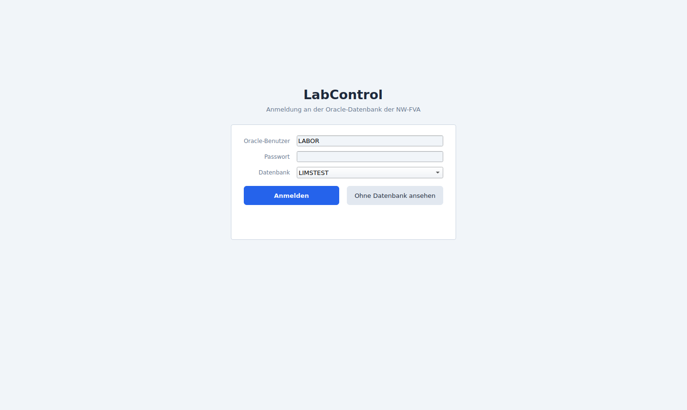
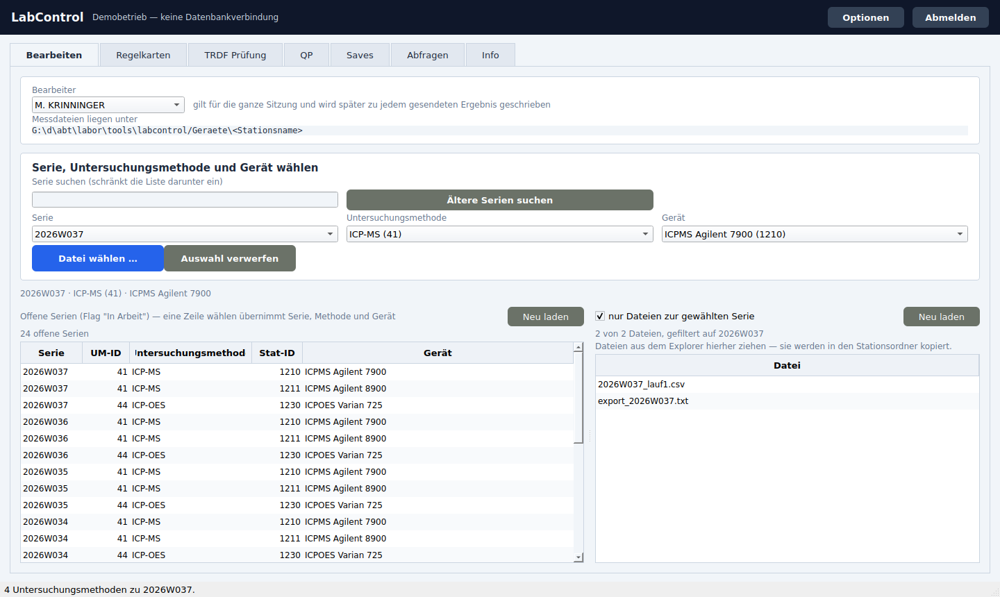
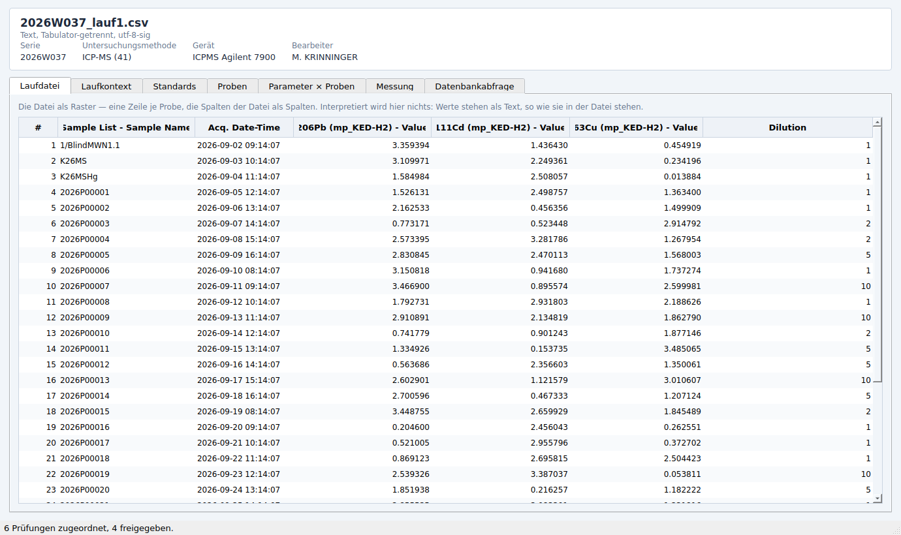
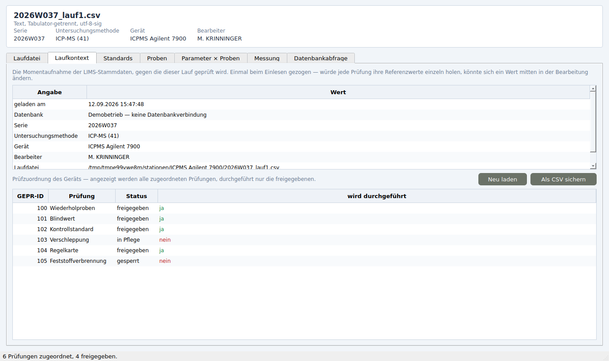

# LabControl von Tkinter nach Qt6 — Stand der Portierung

Portiert wird die Anwendung aus
[michaelkrinningersg-coder/testlims](https://github.com/michaelkrinningersg-coder/testlims).
Der Code liegt hier unter [`labcontrol_qt/`](../labcontrol_qt).

## Entscheidung: vorerst bei Tkinter bleiben

**Stand 12.09.2026.** Die Arbeitsplätze laufen auf 32-bit-Windows, und für
32-bit gibt es Qt 6 nicht (Beleg unten). Damit ist die Portierung heute nicht
einsetzbar — nicht schwierig, sondern unmöglich. Das Original bleibt in
Betrieb.

Zwei Änderungen sind angekündigt und heben je eine Hälfte des Hindernisses auf:

| Voraussetzung | Was sie löst |
|---|---|
| Oracle-Update auf 12.1 oder neuer | Der Thin Mode reicht, kein Oracle-Client mehr nötig |
| Arbeitsplätze auf 64-bit-Windows | Qt 6 läuft überhaupt erst |

**Nötig ist nur die zweite.** Mit 64-bit-Windows genügt schon ein 64-bit
Oracle-Client (19c erreicht die 11.2 noch), das Datenbank-Update ist dann
Zugabe. Sind beide da, entfällt die Client-Frage ganz.

### Wenn es soweit ist

1. Fachschicht frisch nachziehen — sie hat sich im Ursprungs-Repo
   inzwischen weiterentwickelt:
   `python tools/kern_abgleich.py --pfad /pfad/zu/testlims --uebernehmen`
2. `python -m labcontrol_qt` gegen die echte Datenbank starten und den
   Bearbeiten-Reiter gegen das Original halten.
3. Weiter nach der Modultabelle unten. Der nächste sinnvolle Schritt sind die
   Auswertungsreiter des Messfensters, weil dort der Nutzen sitzt: farbige
   Einzelzellen und große Tabellen.

Bis dahin braucht das Portierte keine Pflege. Es liegt vollständig, getestet
und gebaut da und wartet; nur die Fachschicht in `kern/` altert gegenüber dem
Ursprung — deshalb Schritt 1.

### Der Beleg, damit ihn niemand noch einmal erheben muss

Aus den Metadaten von PyPI, Stand 12.09.2026:

| Paket | 32-bit-Windows (`win32`) |
|---|---|
| PySide6 6.11.2 | **nein** — nur `win_amd64`, `win_arm64` |
| PyQt6 6.11.0 | **nein** — nur `win_amd64`, `win_arm64` |
| PyQt5 5.15.11 | ja — `cp38-abi3-win32.whl`, ab Python 3.8 |
| PySide2 5.15.2.1 | ja, aber nur bis Python 3.10 |
| oracledb 3.4.2 | ja — `win32` ab cp39 |

Qt hat 32-bit-Windows mit Qt 6 gestrichen; beide Bindings folgen dem. Der
Umweg über **Qt 5** wäre technisch möglich, ist aber verworfen: 18 000 Zeilen
auf einen Unterbau umzubauen, dessen Open-Source-Pflege 2023 endete, lohnt
den Aufwand nicht.

## Warum: die Portierung schneidet heute den Weg zur Datenbank ab

Der lange Grund hinter der Entscheidung oben.

Die LIMS-Datenbank der NW-FVA ist eine **Oracle 11.2**. Der Thin Mode von
python-oracledb spricht erst mit 12.1 — im Quelltext steht das ausdrücklich:

> „Die NW-FVA arbeitet auf 11.2, dort fällt diese Entscheidung immer."
> — `lims_db._vorrat_bauen`

Deshalb lädt LabControl den **Oracle-Client aus `C:\Oracle\11.2.0`** nach und
verbindet im Thick Mode. Dieser Client ist 32-bit, also muss das Programm
32-bit sein — genau darum baut der Workflow des Originals eine x86-exe und
nennt sie „die sichere Wahl".

**Qt 6 gibt es nicht für 32-bit Windows.** PySide6 liefert kein `win32`-Rad,
nur `win_amd64`; nachprüfbar in einer Zeile:

```console
$ pip download PySide6 --platform win32 --only-binary=:all: --python-version 3.12
ERROR: Could not find a version that satisfies the requirement PySide6 (from versions: none)
```

Eine Qt6-Fassung ist damit zwangsläufig 64-bit und kann den vorhandenen
Client nicht laden. Sie käme an die 11.2 **gar nicht heran**. Vier Wege
führen daran vorbei:

| Weg | Was zu tun ist | Woran es hängt |
|---|---|---|
| **64-bit-Client** | Oracle Instant Client 19c (64-bit) auf die Arbeitsplätze | 19c erreicht 11.2 noch; danach `oracledb<4` beibehalten oder anheben |
| **Datenbank anheben** | LIMS auf 12.1 oder neuer | dann reicht der Thin Mode, kein Client mehr nötig |
| **Brückenprozess** | Datenbankteil bleibt 32-bit-Python, die Qt6-Oberfläche spricht über eine lokale Leitung mit ihm | zwei Prozesse, zwei Bauten, eine Schnittstelle mehr |
| **Bei Tkinter bleiben** | nichts | Qt6 entfällt |

Der Brückenweg ist in dieser Portierung schon vorgesehen: die Oberfläche
spricht nie mit `lims_db`, sondern mit einer **Quelle**
([`labcontrol_qt/quelle.py`](../labcontrol_qt/quelle.py)). `LimsQuelle` und
`DemoQuelle` erfüllen dieselbe Schnittstelle; eine `BrueckenQuelle` würde
sich daneben stellen, ohne dass ein Fenster davon erfährt.

## Was portiert ist

| | |
|---|---|
| Fachschicht unverändert übernommen | **9 822 Zeilen** in 7 Modulen |
| Oberfläche neu in Qt6 | **1 555 Zeilen** in 10 Modulen |
| Oberfläche des Originals gesamt | **18 140 Zeilen** in 25 Modulen |

Fertig und benutzbar:

* **Anmeldung** — Benutzer, Passwort, Datenbank; einmal mit einer echten
  Verbindung geprüft, Passwort nirgends gespeichert.
* **Bearbeiten-Reiter, vollständig** — Bearbeiter für die Sitzung, Serie mit
  Suchfeld, „Ältere Serien suchen", Untersuchungsmethode, Gerät, die
  Übersicht der offenen Serien (ein Klick übernimmt alle drei Angaben), die
  Dateiliste des Stationsordners mit dem Haken „nur Dateien zur gewählten
  Serie", Dateidialog und „Auswahl verwerfen".
* **Messfenster** mit den Reitern **Laufdatei** (die Datei als Raster, gelesen
  vom unveränderten `dateien.py`) und **Laufkontext** (Momentaufnahme mit
  Ladezeitpunkt, Prüfzuordnung des Geräts und CSV-Beleg).
* **Bausteine** — Farbschema, Knöpfe, Hinweise, Rasteranzeige mit Farbe je
  Zelle, Zahlenspalten rechtsbündig.

## Was offen ist

Die Fachlogik dahinter liegt jeweils schon in `kern/` oder im Ursprungs-Repo;
zu bauen ist die Oberfläche.

| Modul im Original | Zeilen | Stand |
|---|---:|---|
| `labcontrol.py` | 4 076 | teilweise — Anmeldung und Bearbeiten portiert; offen: Optionsdialog (~1 770), Regelkarten (~1 718), Saves, Abfragen, Info |
| `messfenster.py` | 3 183 | teilweise — Laufdatei und Laufkontext portiert; offen: Standards, Proben, Parameter × Proben, Messung, Datenbankabfrage |
| `qpreiter.py` | 3 167 | offen |
| `trdfreiter.py` | 1 865 | offen |
| `eingaberaster.py` | 934 | offen |
| `trdflegende.py` | 459 | offen |
| `trdfblock.py` | 387 | offen |
| `reiterleiste.py` | 354 | entfällt — Qt bricht Reiterleisten selbst um |
| `vergleichsfenster.py` | 341 | offen |
| `geraetewechsel.py` | 335 | offen |
| `qpvorschau.py` | 335 | offen |
| `exportvorschau.py` | 264 | offen |
| `regelkartenbild.py` | 254 | offen |
| `auswertungsfenster.py` | 228 | offen |
| `pflegevorschau.py` | 216 | offen |
| `qpwahlfenster.py` | 188 | offen |
| `kommentar.py` | 166 | offen |
| `ausreisserfenster.py` | 156 | offen |
| `trdfbild.py` | 135 | offen |
| `kalender.py` | 120 | entfällt — `QDateEdit` bringt den Kalender mit |
| `befundfenster.py` | 94 | offen |
| `widgets.py` · `tabelle.py` · `zellenraster.py` · `suchleiste.py` | 883 | **portiert** (→ 296 Zeilen Qt) |

Eine ehrliche Schätzung für den Rest: rund **10 000 Zeilen Tkinter**, die in
Qt erfahrungsgemäß auf die Hälfte bis zwei Drittel zusammengehen. Das sind
Wochen, keine Stunden — und nichts davon lässt sich sinnvoll blind bauen:
die Auswertungsreiter hängen an Laufdateien echter Geräte und an Stammdaten
aus dem LIMS.

## Was Qt konkret einspart

Nicht als Werbung, sondern als Begründung, warum die portierten Teile
kürzer sind:

* **Farbe je Zelle.** Eine `ttk.Treeview` färbt nur ganze Zeilen. Deshalb gibt
  es `zellenraster.py` mit 425 Zeilen selbst gemaltem Raster. In Qt trägt das
  Modell die Farbe und die Ansicht zeichnet sie — im Prüfpfad-Reiter steht die
  Spalte „wird durchgeführt" grün und rot, ohne eine Zeile Zeichencode.
* **Große Tabellen.** Eine Laufdatei darf 50 000 Zeilen haben. Die Treeview
  legt für jede ein Element an; das Qt-Modell wird nur nach den rund 30
  sichtbaren gefragt.
* **Ziehen aus dem Explorer.** Im Original über `tkinterdnd2`, das die
  tkdnd-Bibliothek zur Laufzeit nachlädt — und je nach Windows-Variante nicht.
  Dann steht in der Oberfläche, dass das Ziehen nicht zur Verfügung steht.
  Qt bringt es mit; der Fallbacktext entfällt.
* **Rollbereiche.** 60 Zeilen Leinwand plus zwei `<Configure>`-Behandlungen,
  die sich gegenseitig aufschaukeln konnten — der Kommentar dort erzählt von
  einem Bau, der deshalb sechs Stunden hing. In Qt ein `QScrollArea`.
* **Abgerundete Knöpfe.** 120 Zeilen Canvas mit eigener Hover- und
  Deaktivierungslogik gegen ein Stylesheet.

Dagegen steht, was Qt kostet: kein 32-bit (siehe oben), rund 70 MB statt
15 MB je exe, und eine zweite Bibliothek, die gepflegt sein will.

## Aufbau

```
labcontrol_qt/
  kern/          unverändert aus testlims — HIER WIRD NICHTS GEÄNDERT
                 lims_db, laufkontext, dateien, config, protokoll,
                 sitzung, verschleppung  (9 822 Zeilen)
  quelle.py      die Naht: LimsQuelle | DemoQuelle | später BrueckenQuelle
  stil.py        Farben, Knöpfe, Karten  (aus widgets.py)
  raster.py      Rasteranzeige mit Farbe je Zelle  (aus tabelle + zellenraster)
  arbeit.py      Arbeit außerhalb des Zeichenfadens
  anmeldung.py   Anmeldemaske
  hauptfenster.py Kopfzeile, Reiter, Bearbeiten-Reiter
  messfenster.py Laufdatei und Laufkontext
  app.py         Start, Demobetrieb, Selbsttest
```

Die Regel für `kern/`: **nicht anfassen.** Eine Änderung dort gehört ins
Ursprungs-Repo und wird von hier erneut übernommen — sonst laufen die beiden
Oberflächen fachlich auseinander, und genau das soll eine Portierung nicht.
Ein Test wacht darüber (`test_die_fachschicht_ist_unveraendert`).

## Windows-EXE

Der Workflow
[`labcontrol-qt-exe.yml`](../.github/workflows/labcontrol-qt-exe.yml) baut die
Portierung zu einer einzelnen Datei und hängt sie als Artefakt
`LabControl-Qt6-windows-x64` an den Lauf. Erster erfolgreicher Lauf:
[#4](https://github.com/michaelkrinningersg-coder/TestArchitecture/actions/runs/34703972226),
2:15 Minuten, 54 MB gepackt.

Vor dem Bau prüft er die Prüfsummen der Fachschicht, danach startet er die
fertige EXE mit `--selftest`. Bricht das ab, gibt es kein Artefakt.

**Die EXE erreicht die Oracle 11.2 nicht** — siehe oben. Zum Ansehen der
Oberfläche taugt sie (`--demo`), zum Arbeiten erst, wenn einer der vier Wege
gegangen ist.

## Starten und prüfen

```bash
pip install -r requirements-qtport.txt

python -m labcontrol_qt --demo        # ohne Datenbank, mit erfundenen Daten
python -m labcontrol_qt               # mit Anmeldung an Oracle
python -m labcontrol_qt --selftest    # hochfahren, prüfen, Rückgabewert

pytest tests/test_labcontrol_qt.py -q # 16 Tests, ohne Fenster
xvfb-run -a python tools/shoot_qtport.py   # Bildschirmfotos
```

Der Demobetrieb ist kein Ersatz für die Anmeldung, sondern der Weg, die
Oberfläche ohne VPN anzusehen — und der Weg, auf dem die Tests und die
Bildschirmfotos entstehen. Die Demoquelle liefert Feld für Feld dieselbe
Gestalt wie die echte: Methoden als `(um_id, kuerzel)`, Geräte als
`(stat_id, station)`, offene Serien als Wörterbuch mit fünf Schlüsseln.
Ob eine Prüfung läuft, entscheidet auch dort `lims_db.pruefung_laeuft`.

## Bilder

| Anmeldung | Bearbeiten |
|---|---|
| [](screenshots/port_anmeldung.png) | [](screenshots/port_bearbeiten.png) |

| Laufdatei | Laufkontext |
|---|---|
| [](screenshots/port_laufdatei.png) | [](screenshots/port_laufkontext.png) |
