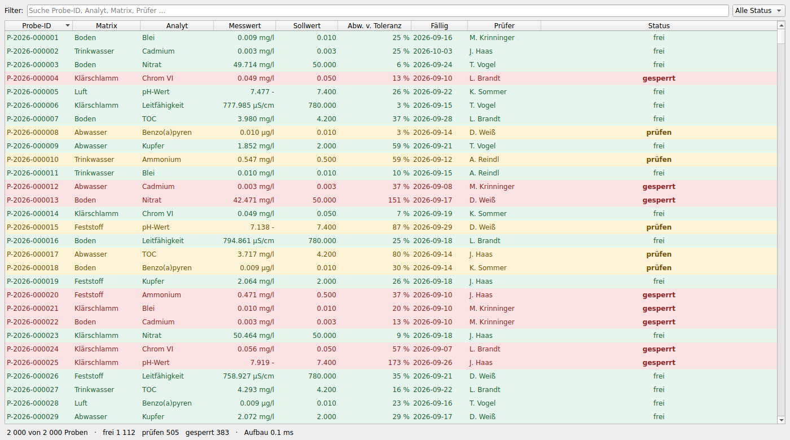
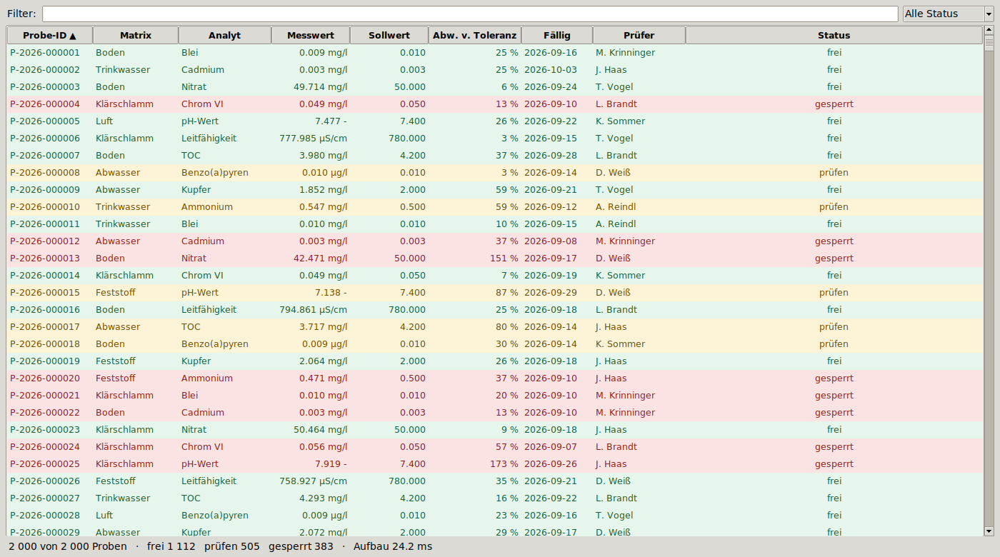
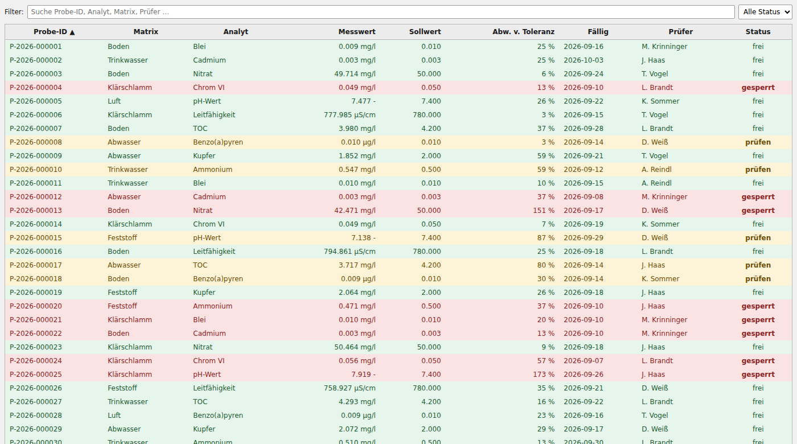

<!-- Dieser Text lag bis zur Aufnahme der Anwendung im README; die Anwendung steht jetzt dort, der Vergleich hier. -->

# LabControl — drei Oberflächen, eine Fachlogik

Dieselbe Anwendung dreimal gebaut: eine Freigabeliste für Laborproben mit
Volltextsuche, Statusfilter, Sortierung und Ampel (frei / prüfen / gesperrt).
Einmal in **Qt**, einmal in **Tkinter**, einmal als **server-gerenderte
Web-Seite**. Alle drei benutzen denselben Fachkern unverändert, zeigen dieselben
Spalten, dieselben Farben und dieselben Daten — damit ein gemessener Unterschied
ein Unterschied der Oberfläche ist und nichts anderes.

Alle Zahlen unten sind auf dieser Maschine gemessen, nicht geschätzt.
Nachrechnen: `tools/run_all.sh`.

## Sofort ausprobieren

```bash
pip install -r requirements.txt

python -m variant_qt.app  --rows 20000     # Qt
python -m variant_tk.app  --rows 20000     # Tkinter
python -m variant_web.app --rows 20000     # Flask → http://127.0.0.1:5000

pytest tests variant_web -q                # 21 Tests, ~0,6 s, ohne Fenster
python bench/run_bench.py --sizes 2000     # schneller Messdurchlauf
tools/run_all.sh                           # Tests + Messungen + Screenshots
```

Ohne Bildschirm (Server, CI):

```bash
QT_QPA_PLATFORM=offscreen python -m variant_qt.app --screenshot qt.png
xvfb-run -a python -m variant_tk.app --screenshot tk.png
```

## Optik

Gleiche 2 000 Proben, gleiche Fenstergröße (1400 × 780), gleicher Filter.

| Qt | Tkinter | Web |
|---|---|---|
|  |  |  |

Gefiltert auf `Cadmium`: [Qt](screenshots/qt_filtered.png) ·
[Tkinter](screenshots/tk_filtered.png) · [Web](screenshots/web_filtered.png).
Nur gesperrte Proben: [Qt](screenshots/qt_blocked.png) ·
[Tkinter](screenshots/tk_blocked.png) · [Web](screenshots/web_blocked.png).

Die beiden Desktop-Varianten sehen sich sehr ähnlich, weil beide die
Plattformschrift und das Systemthema benutzen. Zwei Unterschiede sind keine
Geschmacksfrage, sondern Grenzen des Widgets:

* Ein `ttk.Treeview` färbt **nur ganze Zeilen**. Eine Ampel als farbige
  Einzelzelle gibt es dort nicht; Qt kann das über `Qt.BackgroundRole` pro
  Zelle, die Web-Variante über eine CSS-Klasse pro Zelle. Damit die Bilder
  vergleichbar bleiben, färben hier alle drei die ganze Zeile.
* Fettdruck pro Zelle kann der Treeview ebenfalls nicht — der Status steht dort
  in normaler Schrift, in Qt und im Browser fett.

## Umfang

Codezeilen ohne Leerzeilen, Kommentare und Docstrings (`python tools/count_loc.py`):

| | Oberfläche | CLI-Gerüst | gesamt |
|---|---|---|---|
| Tkinter | **111** | 34 | 145 |
| Web (Python + Template) | **139** | 12 | 151 |
| Qt | **145** | 31 | 176 |
| *gemeinsamer Fachkern* | *175* | – | *175* |

Das CLI-Gerüst (argparse, Screenshot-Ausgabe) ist Messwerkzeug, keine Anwendung,
deshalb getrennt ausgewiesen. Von den 139 Zeilen der Web-Variante sind 29 CSS —
Gestaltung, die Qt und Tkinter geschenkt bekommen.

**Der Abstand ist klein.** 111 gegen 139 gegen 145 Zeilen, ein Unterschied von
34 Zeilen zwischen der kleinsten und der größten Variante. Der Grund steht in
der letzten Zeile der Tabelle: sobald Ampelregeln, Filter und Sortierung einmal
in `core/` liegen, bleibt in jeder Variante nur noch die Anbindung an das
Toolkit übrig. Qt zahlt seinen Mehraufwand fast vollständig für
das Tabellenmodell (`SampleTableModel`, 44 Zeilen) — und bekommt dafür genau das
Tempoverhalten, das die nächste Tabelle zeigt.

## Tempo

Gemessen wird der Weg vom geänderten Filter bis zur fertigen Tabelle. Zwei
Zahlen pro Zelle, weil sie verschiedene Fragen beantworten:

* **Aktualisierung** — filtern, sortieren, Ergebnis an das Widget geben.
* **gezeichnet** — dasselbe plus erzwungenes, synchrones Neuzeichnen.

Median aus fünf Durchläufen (drei bei 100 000), Millisekunden.
Rohdaten: `bench/results.json`, Tabellen: `bench/results.md`.

### Vollaufbau: Filter leeren, alle Zeilen anzeigen

| | 2 000 | 20 000 | 100 000 |
|---|---|---|---|
| gemeinsamer Kern (Untergrenze) | 0,9 | 9,5 | 49,2 |
| Qt — Aktualisierung | **1,1** | **10,1** | **48,7** |
| Qt — gezeichnet | 71,8 | 78,4 | 144,4 |
| Tkinter — Aktualisierung | 25,0 | 263,1 | 1 251,6 |
| Tkinter — gezeichnet | 36,5 | **485,7** | **2 864,2** |
| Web — Server-Antwort (200 Zeilen) | 3,9 | 10,5 | 53,1 |

### Filter-Tastendruck (`blei`, rund ein Zehntel der Zeilen), gezeichnet

| | 2 000 | 20 000 | 100 000 |
|---|---|---|---|
| gemeinsamer Kern | 0,5 | 5,1 | 26,3 |
| Qt | 63,2 | 74,7 | 102,1 |
| Tkinter | **15,6** | 70,4 | 438,2 |
| Web — Server-Antwort | 3,5 | 6,8 | 30,0 |

Was darin steht:

**Qt kostet nichts, was mit der Zeilenzahl wächst.** Die Aktualisierungszeile
liegt auf der Untergrenze des gemeinsamen Kerns (1,1 gegen 0,9 · 10,1 gegen 9,5
· 48,7 gegen 49,2 ms). Qt fragt nur die Zellen ab, die es zeichnet — 29 sichtbare
Zeilen, unabhängig davon, ob 2 000 oder 100 000 dahinterliegen. Alles, was bei
Qt mit N wächst, ist Python-Code, den die anderen beiden genauso ausführen.

**Bei Tkinter wächst beides mit N.** Nicht nur das Einfügen (25 → 263 → 1 252 ms),
auch das Zeichnen (11 → 223 → 1 613 ms Aufschlag): der Treeview legt jedes
Element an, nicht nur die sichtbaren. Bei 20 000 Zeilen dauert das Leeren des
Suchfelds knapp eine halbe Sekunde, bei 100 000 fast drei.

**Unter ein paar tausend Zeilen ist Tkinter nicht langsamer.** Bei 2 000 Zeilen
ist es für einen Filter-Tastendruck sogar schneller als Qt (15,6 gegen 63,2 ms):
Tkinter füllt 200 Treffer und zeichnet nur das Nötige, Qt zeichnet nach jedem
Modell-Reset das ganze Sichtfeld neu. Wo der Gleichstand genau liegt, ist
nachgemessen (`bench/results_crossover.json`, gezeichneter Vollaufbau):

| Zeilen | 3 000 | 4 000 | 6 000 | 8 000 |
|---|---|---|---|---|
| Qt | 70,7 | 72,1 | 78,7 | 74,4 |
| Tkinter | 48,0 | 59,2 | 68,8 | 90,1 |

Hier kippt es zwischen 6 000 und 8 000 Zeilen. Diese Grenze ist aber ein Artefakt
des konstanten Zeichenaufwands dieser Umgebung, kein Eigenschaftsunterschied der
Toolkits: ohne erzwungenes Neuzeichnen liegt Qt bei jeder Größe vorn (2,0 gegen
39,6 ms bei 4 000 Zeilen, 4,1 gegen 97,0 ms bei 8 000). Mit schnellerer Grafik
wandert der Gleichstand nach links und verschwindet praktisch. Ein erster
Messdurchlauf legte ihn zwischen 4 000 und 6 000 — die Streuung von Qts
Zeichenkonstante ist größer als der Abstand der beiden Kurven in diesem Bereich.

**Zum Zeichnen, ehrlich gesagt:** der Aufschlag bei Qt (70 · 68 · 96 ms) ist
Software-Rasterung in einem Container ohne GPU. Einzeln gemessen
(`QT_QPA_PLATFORM=offscreen python bench/paint_probe.py`) kostet ein `repaint()`
hier 28 bis 36 ms — bei 2 000, 20 000 und 100 000 Zeilen gleich viel, weil immer
dieselben 29 Zeilen sichtbar sind. Auf einem echten Arbeitsplatz ist das
deutlich weniger. Konstant bleibt es dort auch: Qt zeichnet immer nur das
Sichtfeld. Bei Tkinter ist der Zeichenanteil dagegen
selbst von N abhängig, und das ändert sich auf schnellerer Hardware nicht,
sondern skaliert nur.

Deshalb hat die Tkinter-Variante ein Debouncing von 150 ms im Suchfeld
(`variant_tk/app.py`), die Qt-Variante nicht. Ohne das entstünde bei 20 000
Zeilen pro Tastendruck ein Aufbau von bis zu einer halben Sekunde.

## Nutzlast der Web-Variante

Die Seite zeigt bewusst nur 200 Zeilen. Was passiert, wenn man die Grenze
aufhebt (`--limit 0`):

| Zeilen | HTML mit Grenze | gzip | HTML ohne Grenze | gzip | Serverzeit ohne Grenze |
|---|---|---|---|---|---|
| 2 000 | 74 KB | 5 KB | 0,69 MB | 35 KB | 27,7 ms |
| 20 000 | 74 KB | 5 KB | **6,83 MB** | **322 KB** | 268,1 ms |
| 100 000 | 74 KB | 5 KB | 34,12 MB | 1,56 MB | 1 761,9 ms |

Und im echten Browser (Chromium, Navigation bis fertiges Layout):

| Zeilen | mit Grenze (200 Zeilen) | ohne Grenze |
|---|---|---|
| 2 000 | 54,6 ms | 923,1 ms |
| 20 000 | **74,6 ms** | **3 902,8 ms** |

Zwei Korrekturen an der Faustregel „etwa 3 MB pro Interaktion bei 20 000 Zeilen":

* **Roh ist es mehr, übertragen deutlich weniger.** 6,83 MB unkomprimiert, aber
  322 KB nach gzip — und gzip macht jeder Webserver von selbst. Die Bytes auf der
  Leitung sind nicht das Hauptproblem.
* **Das Problem ist der Browser.** 3,9 Sekunden bis die 20 000 Zeilen im Layout
  stehen, gegen 74,6 ms mit Grenze. Faktor 52. Die 200-Zeilen-Grenze ist keine
  Sparmaßnahme an Bandbreite, sie ist der Unterschied zwischen benutzbar und
  unbenutzbar.

Nebenbei aufgefallen und behoben: ein `style`-Attribut pro Zeile statt einer
CSS-Klasse kostete bei 20 000 Zeilen rund 780 KB zusätzliches HTML. Die
Ampelfarben kommen weiterhin aus `core/model.py`, werden aber einmal im
`<style>`-Block ausgegeben statt 20 000-mal.

## Prüfbarkeit

21 Tests, rund 0,6 Sekunden, kein Fenster:

```
pytest tests variant_web -q
20 passed, 1 skipped in 0.55s     # ohne DISPLAY
21 passed in 0.58s                # unter xvfb-run
```

* `tests/test_core.py` — 12 Tests auf Ampelgrenzen, Überfälligkeit, Suche,
  Sortierung, Determinismus der Daten. Kein Toolkit beteiligt.
* `variant_web/test_app.py` — 6 Tests auf die vollständige Oberfläche: Filter,
  Sortierrichtung, Ampel-Markup, Leerzustand, 200-Zeilen-Grenze, Statuszähler.
  Über den Flask-Testclient, ohne Server und ohne Browser.
* `tests/test_variants_headless.py` — 3 Tests darüber, was jede Variante
  überhaupt zum Testen braucht.

Der letzte Punkt ist der interessante, und er fällt anders aus als erwartet:

* Das **Qt-Tabellenmodell** ist ohne Fenster prüfbar, das ganze Qt-Fenster mit
  `QT_QPA_PLATFORM=offscreen` ebenfalls — `window.search.setText("Cadmium")`
  und dann `window.model.rowCount()` abfragen funktioniert in normalem pytest,
  ohne pytest-qt, ohne X-Server.
* Die **Tkinter-Variante** lässt sich ohne X-Server nicht einmal instanziieren.
  Genau dieser eine Test wird oben übersprungen. Unter `xvfb-run` läuft er.
* Die **Web-Variante** braucht gar nichts.

Der Vorsprung der Web-Variante bei der Prüfbarkeit ist damit real, aber kleiner
als er wirkt — und er verschiebt sich, sobald der Fachkern geteilt ist: was für
die Nachvollziehbarkeit zählt, sind die Ampelregeln, und die liegen in
`core/model.py`, werden einmal geprüft und gelten für alle drei Varianten. Was
oberflächenspezifisch bleibt, ist die Anbindung.

## Was hier nicht gemessen ist

* **Ein Nutzer.** Alle Zahlen kommen aus erzwungenen Zustandswechseln, nicht aus
  echtem Tippen. Debouncing, Bildwiederholrate und Eingabelatenz des Fenstersystems
  kommen im Alltag dazu.
* **Echte Grafikhardware.** Xvfb und der Offscreen-Backend rastern auf der CPU.
  Absolutwerte sind pessimistisch, die Skalierung ist es nicht.
* **Bearbeiten, Speichern, Mehrbenutzerbetrieb, Rechte, Prüfpfad.** Alle drei
  Varianten sind reine Leseansichten. Der ganze schreibende Teil fehlt,
  und dort liegen die Unterschiede zwischen Desktop und Web ganz woanders
  (Sperren, Transaktionen, Signaturen).
* **Verteilung und Betrieb.** Ein Qt-Programm muss auf jeden Rechner, eine
  Web-Seite auf einen Server. Das entscheidet in der Praxis oft mehr als
  Millisekunden.
* **Große Datenmengen im Browser.** Die Web-Variante ist nur deshalb schnell,
  weil sie 200 Zeilen zeigt. Wer dort scrollbare 100 000 Zeilen will, braucht
  virtuelles Scrollen — dann verschiebt sich der Vergleich noch einmal.

## Aufbau

```
core/            Fachlogik: Modell, Ampelregeln, Datengenerator, Filter/Sortierung
variant_qt/      PySide6: QTableView über QAbstractTableModel
variant_tk/      Tkinter: ttk.Treeview mit Zeilen-Tags und Debouncing
variant_web/     Flask: server-gerendertes HTML + pytest-Tests
bench/           Messwerkzeug und Ergebnisse (results*.json, results*.md, paint_probe.py)
tools/           Screenshots, Zeilenzählung, run_all.sh
tests/           Fachkern und Testvoraussetzungen der Varianten
docs/screenshots Bilder aller drei Varianten in drei Zuständen
```

## Messumgebung

Intel Xeon @ 2,10 GHz, 4 Kerne · Python 3.12.3 · PySide6 6.11.2 · Tk 8.6 ·
Flask 3.1.3 · Chromium (Playwright 1.62) · Xvfb 1440 × 900 × 24 ·
gemessen am 2026-09-12.

Systempakete für die Qt- und Tkinter-Variante auf Ubuntu 24.04:

```bash
apt-get install python3-tk xvfb libegl1 libgl1 libxkbcommon-x11-0 \
    libxcb-cursor0 libxcb-icccm4 libxcb-keysyms1 libxcb-shape0 \
    libxcb-randr0 libxcb-render-util0 libxcb-xinerama0 libxcb-xfixes0 \
    libxcb-image0 libdbus-1-3 libfontconfig1 fonts-dejavu-core
```
